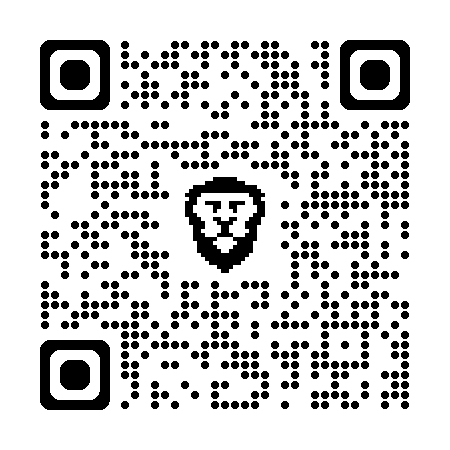

<!-- _class: invert -->

# <!-- fit --> About me

---

# Shogo SENSUI

---

# Work History

- 新卒で入社した SIer で、某放送局向けパッケージシステムや某コンビニエンスストア向けイントラシステムの開発に従事
- 株式会社サイバーエージェントでは、プロダクト開発の傍ら[システムの性能改善](https://developers.cyberagent.co.jp/blog/archives/6057/)や [Web 技術の推進](https://developers.cyberagent.co.jp/blog/archives/9540/)といった横断活動やエンジニアリングマネジメントに従事
- 株式会社メルカリに入社後は、[メルペイの立ち上げ](https://engineering.mercari.com/blog/entry/20201222-merpay-frontend/)や[メルカリ Web のリプレイス](https://engineering.mercari.com/blog/entry/20210810-the-new-mercari-web/)をリードし、エンジニアリング担当 VP としてグループ経営に従事
- デジタル庁では、マイナンバーポータルプロジェクトで技術的観点からベンダーマネジメントにコミットし、[行政のデジタル化を推進](https://digital-gov.note.jp/n/n30b3164a54dc)
- 株式会社ハウテレビジョンでは新卒事業を管掌し、[技術負債の解消プロジェクトのリードや分断した組織の統合を推進](https://blog.howtelevision.co.jp/entry/2023/12/01/000000)

---

---

# As Advisor

- 社員数は一桁から四桁まで、フェーズはシードから上場まで、フォーカスは開発技術から経営課題まで、様々な組織を支援
- 少し前だと[ドクターズプライムのフロントエンド開発の現状](https://blog.drsprime.com/entry/26)
  - [静的解析を整備してコードベースをボトムアップ](https://blog.drsprime.com/entry/2022/08/16/090000)、[社内勉強会を公開して対外的認知を向上](https://blog.drsprime.com/entry/2022/03/29/110000)、[ソフトウェア性能と KPI の相関を可視化](https://blog.drsprime.com/entry/2022/02/10/170000) など
- 最近では [三年間の関わりから見る PR TIMES エンジニアリングの変化](https://developers.prtimes.jp/2024/09/25/transition-of-prtimes-engineering/) など

---

# As Advocate

- [TechFeed の公認エキスパート](https://techfeed.io/people/@1000ch) (JavaScript/Web 標準) や [HTML5Experts.jp のエキスパート](https://html5experts.jp/1000ch)として Web 技術の啓蒙に従事
- [イベントでの登壇やメディアでのインタビューや寄稿](https://shogosensui.com/activity/)、[技術誌の連載や書籍の出版](https://shogosensui.com/book/)を通じて、技術の知見やプロダクト開発における事例を共有

---

---

<!-- _header: 最近の関心もとい貢献していきたいこと -->

## 日本を支える産業や文化の新陳代謝

JTC やスタートアップへのコミットを通じた、未来の標準となる事業や組織の創出

## タスクではなくイシューにフォーカスする組織

一人ひとりが作業ではなく解くべき課題に向き合い、互いを尊重し協調するチーム

---

# Further information

- [shogosensui.com](https://shogosensui.com/)
- [Amazon 著者ページ](https://www.amazon.co.jp/stores/author/B00KX3TKQE)
