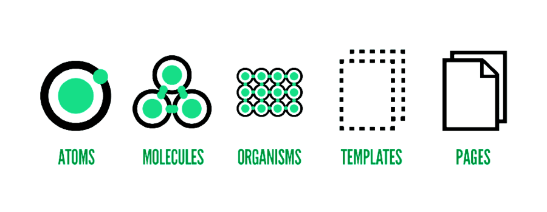

<!-- _class: invert -->

# <!-- fit --> Webフロントエンドにおけるコンポーネント化のアプローチ

2017.02.25 [Inside Frontend #1](https://inside-frontend.connpass.com/event/47920/)

---

# @1000ch

> Web アプリケーション開発を専門とするソフトウェアエンジニア。企業で働く傍ら、様々な企業のエンジニアリングに顧問として関わり、高品質で維持しやすい Web アプリケーションを作るための活動を続けている。

---

# ソフトウェアにおけるコンポーネント

> コンピュータソフトウェアにおいて部品とは特定の機能を果たす単位で、特に再利用を考えて汎用に開発されたもの。

---

<!-- _class: invert -->

# そもそもなぜコンポーネントの概念を持ち込みたいのか？

---

## アプリケーションというコンテキストにおいて

- デザインや機能としての再利用性、一貫性、独立性
- 意味として UI や振る舞いを含み、情報システムを成すもの
- コンポーネントはデザインという領域に依存しない

---

<!-- _class: invert -->

## 再利用可能なデザイン ≠ コンポーネント

デザインにおけるコンポーネント化は、デザインに一貫性を持たせた結果に過ぎない

---

<!-- _class: invert -->

# Atomic Design by Brad Frost

情報システムをデザインするためのデザイン原則

---

<!-- _class: invert -->

# クライアントサイドにおけるコンポーネントの構築プロセス

---

## デザインプロセス上は UI と機能を分離しない

ユーザーインターフェースから機能を知覚させる

---

## プログラム実装上は UI と機能を分離する

UI レイヤと機能レイヤを明確に分け、プログラム部品としてのコンポーネント化する

---

## 実装上の UI と機能分割

- Android: View XML で UI、Fragment で機能
- iOS: Storyboard/Xib で UI、ViewController で機能
- Web: HTML+CSS で UI、JavaScript で機能

---

<!-- _class: invert -->

# 職能への要求と理想の剥離

---

## デザイナーには全体図を表現することが課せられる

- お客様への提案のため「モックアップを作らねば」
- **情報をデザインする意識** の欠如
- **デザインシステムとして評価される仕組み** が組織にないこと

---

## 開発プロセスにおいて実装よりデザインが先にある

- デザイナーには全体図を表現することが課せられる
  - 「お客様への提案のためモックアップを作らねば」
  - **情報をデザインする意識** の欠如
- 実装時に発覚する様々な考慮漏れ
  - 「各種ディスプレイサイズでのどう振る舞うか」とか
  - デザイナーだけでなく **クライアント実装に関わる人全員の責務**

---

## アプリケーションの要件として

- デザインシステムとして評価される仕組みの有無
  - リテラシーが低いユーザーがターゲットであればコスパが悪い？
  - 組織がデザインシステムの価値をどう捉えているか

---

## コンポーネントが成果物の価値を左右する

- 情報システムとして優れているか
  - アプリケーションの目的を提供出来ているか
- アプリケーションの品質を成す要素を担保出来ているか
  - パフォーマンス・アクセシビリティ・セキュリティ…
  - コンポーネントの破綻はソフトウェア上の犠牲に成り得る
