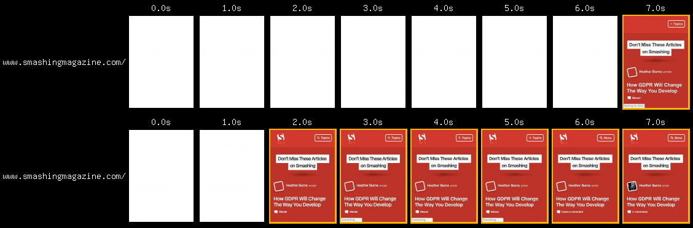
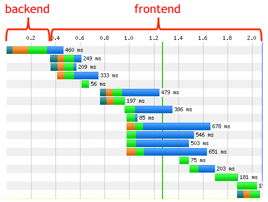
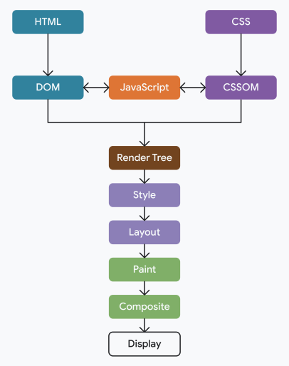

<!-- _class: invert -->

# <!-- fit --> Critical Rendering Path

by [@1000ch](https://shogosensui.com)

---

# パフォーマンスはユーザー体験に直結する

同じ 7 秒でページの読み込みが完了しているが、ユーザー体験が良いのはどちらか？



---

# ボトルネックの大半は Frontend

URL にリクエストしてから HTML がレスポンスされるまで、ブラウザは何もできない。Web アプリケーションの高度化に伴い Frontend は複雑化の一途を辿る。



---

# ブラウザが Web ページを表示するまでの流れ

1. URL をパースし、DNS Lookup で IP アドレスを解決する
2. TCP 接続のためにソケットを開き [TLS handshake](https://www.cloudflare.com/ja-jp/learning/ssl/what-happens-in-a-tls-handshake/) を実行する
3. HTTP 接続の確立後、URL への GET リクエストをサーバーへ送信する
4. サーバーが構築し返答した HTML を受け取り、ページを描画する

---

# Critical Rendering Path

ブラウザが HTML、CSS、JavaScript を処理して画面に表示するまでの一連のプロセス。各ステップがブロックする関係にあり、ページロード時だけでなく閲覧中も発生する



---

# 各ステップの詳細

1. HTML を解析し DOM ツリーを構築する
2. CSS を解析し CSSOM ツリーを構築する
3. DOM ツリーと CSSOM ツリーを組み合わせてレンダーツリーを構築する
4. レンダーツリーから各要素の位置とサイズを計算し、配置を決定する
5. 計算された位置とサイズに基づいてピクセルを描画する

---

# レンダーツリー構築からの layout/paint

<iframe loading="lazy" src="https://www.youtube.com/embed/ZTnIxIA5KGw" style="height: 85%; aspect-ratio: 16/9; border: 0;"></iframe>

---

# HTML は上から順にパースされる

これらのリソースはどのようにロードされ、実行されるでしょう？

```html
<html>
  <head>
    <link rel="stylesheet" href="app.css">
    <script src="a.js" type="module"></script>
    <script src="b.js" type="module" async></script>
    <script src="c.js" defer></script>
    <script src="d.js" async></script>
    <script src="e.js"></script>
  </head>
  <body>
    
  </body>
</html>
```

---

# JavaScript はパーサーをブロックする

JavaScript の実行はブラウザの HTML パーサー処理をブロックする


---

# CSS はレンダリングをブロックする

CSS のロードが遅れてスタイルが適用されない例 ([Flash of Unstyled Content](https://en.wikipedia.org/wiki/Flash_of_unstyled_content))

<video autoplay controls loop muted playsinline style="width: 100%; height: 70%; float: right;">
  <source src="img/fouc.webm?hl=ja" type="video/webm">
</video>

---

# この HTML の改善点は？

```html
<html>
  <head>
    <script src="lib.js"></script>
    <script src="app.js"></script>
    <link rel="stylesheet" href="app.css">
  </head>
  <body>
    
  </body>
</html>
```

<script type="module">
import mermaid from 'https://unpkg.com/mermaid@11/dist/mermaid.esm.min.mjs';
mermaid.initialize({startOnLoad: true});
</script>

