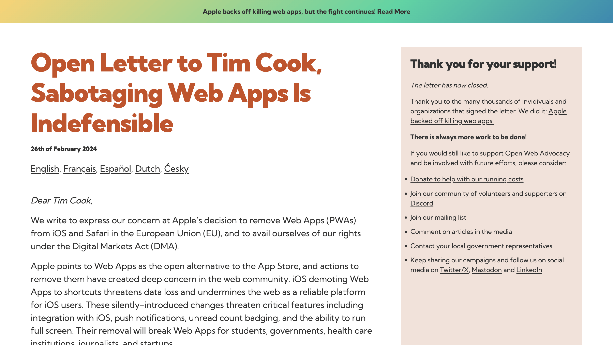

<!-- _class: invert -->

# <!-- fit --> EU のデジタル市場法と Apple

---

## Shogo SENSUI ([shogosensui.com](https://shogosensui.com))

SIer での受託開発を経て、2012 年に株式会社サイバーエージェントに入社。プロダクト開発の傍ら、エンジニア組織のマネジメントに従事。2018 年に株式会社メルカリに入社後は、[株式会社メルペイの Frontend チームの立ち上げ](https://engineering.mercari.com/blog/entry/20201222-merpay-frontend/)や [Web 版の「メルカリ」の刷新](https://engineering.mercari.com/blog/entry/20210810-the-new-mercari-web/)、[メルカリアプリのコードベース刷新](https://engineering.mercari.com/blog/entry/20221213-ground-up-app/)を牽引した後に、執行役員 VP of Engineering としてメルペイのエンジニアリング部門を管掌。2023 年 4 月にデジタル庁入庁。2023 年 7 月に株式会社ハウテレビジョン入社、執行役員プロダクト本部長に就任。[mond 認定回答者](https://mond.how/1000ch)、[TechFeed 公認エキスパート](https://techfeed.io/people/@1000ch) (Web 標準技術 • JavaScript)。

---

<!-- _class: invert -->

# 2024年2月 某日

iOS 17.4 で PWA のサポートが削除されるという事件が勃発

---

<!-- _header: PWA についてのおさらい -->

# そもそも PWA とは?

- [Progressive Web Apps](https://web.dev/explore/progressive-web-apps?hl=ja) の略で、[2015 年に提唱された概念](https://www.youtube.com/watch?v=MyQ8mtR9WxI)
- 平たく言うと「セキュアで高速かつ **インストール可能な Web アプリ**」
- [X](https://x.com) や [Instagram](https://instagram.com)、[Squoosh](https://squoosh.app) などの Web アプリで実装されている

---

# PWA の存在に対する各種姿勢

## サービス事業者や Web 開発者は Strongly Positive

- Web は中立的に統治され、進化してきたオープンなプラットフォーム
- Web アプリの柔軟性が高まることで、プロダクトの価値提供の幅が広がる

## Google や Apple のようなプラットフォーマーの目線

- Google は Web がビジネスの土台であり、力強く推進してきた
- Apple は Web を支持しつつも、プラットフォームの力が弱まる要因になり得る

---

<!-- _class: invert -->

# <!-- fit --> なぜ Apple は EU における   PWA のサポートを削除したか

---

# EU の[デジタル市場法](https://ja.wikipedia.org/wiki/デジタル市場法)

> デジタル市場法は、特にビッグテック企業を対象としている。DMAは、おそらくはApple、Google、Facebook、Amazonを含む、ユーザー数、資本金、市場支配力、売上高に応じた特定のプラットフォームを「ゲートキーパー」として分類し、新たな義務を課すことを提案した。大企業が市場支配力を乱用することを防ぎ、中小企業や新規参入者が市場に参入できるようにすることを目的としている。
> via https://ja.wikipedia.org/wiki/デジタル市場法

---

# [デジタル市場法の要求に対する Apple の対応](https://developer.apple.com/support/dma-and-apps-in-the-eu/)

## ブラウザエンジン選択の自由化

> EUのユーザーがiOS 17.4で初めてSafariを開くと、デフォルトのブラウザを選択するように求められ、その市場で利用可能な主要なウェブブラウザのリストが提示されます。その中からデフォルトのブラウザを選択できます

## 他ブラウザを認めるために削除するという主張

> 代替ブラウザエンジンを使用してウェブアプリに関連する複雑なセキュリティとプライバシーの懸念に対処するには、現在のiOSには存在せず、DMA やホームスクリーンのウェブアプリの非常に低いユーザー採用率などの他の要件を考慮すると実現が困難です

---

<!-- _class: invert -->

# <!-- fit --> 対する市場の反発

---

# PWA サポートの削除意味するところ

## iOS への参入障壁を高める

PWA による価値提供が選択肢としてなくなる。

## Web の持つ中立性と潜在的なパワーを弱める

「どこでも等しく機能する」という価値が薄まる。

---

# Web 業界は阿鼻叫喚

  <blockquote class="twitter-tweet">
🔥It&#39;s official🔥  👿Evil Apple is back, and it&#39;s killing PWAs on iOS for EU users🇪🇺  &quot;To comply with the DMA’s requirements, we had to remove the Home Screen web apps feature in the EU.  －&quot;Very low user adoption of Home Screen web apps&quot; －&quot;Minimal impact to their functionality&quot; <a href="https://t.co/NNe7v6IscP">pic.twitter.com/NNe7v6IscP</a>
&mdash; Maximiliano Firtman (@firt) <a href="https://twitter.com/firt/status/1758214093649969417?ref_src=twsrc%5Etfw">February 15, 2024</a></blockquote>
  <blockquote class="twitter-tweet">
PWAs won&#39;t work on iOS, but only in the EU.  Q: Why is it a big deal? A:  Most businesses choose PWA apps because they want to: 1- Avoid app stores 2- Write one code for both iOS and Android  With <a href="https://twitter.com/hashtag/Apple?src=hash&amp;ref_src=twsrc%5Etfw">#Apple</a> removing PWA support in iOS for EU users, businesses now have to: 1- Write a…
&mdash; Mysk 🇨🇦🇩🇪 (@mysk_co) <a href="https://twitter.com/mysk_co/status/1763222312176771350?ref_src=twsrc%5Etfw">February 29, 2024</a></blockquote>

---

<!-- _header: Open Web Adovocacy による働きかけ -->

---

# 無事に PWA サポートを再開

  <blockquote class="twitter-tweet">
🚨🚨🚨🚨 Apple will NOT remove PWA support on iOS  🥳🥳🥳🥳  👉This is an official statement form Apple that replaced today the previous excuses published around the removal.  We did it, folks! <a href="https://t.co/sp00ILHzdz">pic.twitter.com/sp00ILHzdz</a>
&mdash; Maximiliano Firtman (@firt) <a href="https://twitter.com/firt/status/1763598540389929313?ref_src=twsrc%5Etfw">March 1, 2024</a></blockquote>
  <blockquote class="twitter-tweet">
iOS 17.4 is out, and Progressive Web Apps (PWAs) are back 💪<a href="https://twitter.com/hashtag/iOS?src=hash&amp;ref_src=twsrc%5Etfw">#iOS</a> <a href="https://twitter.com/hashtag/Apple?src=hash&amp;ref_src=twsrc%5Etfw">#Apple</a> <a href="https://twitter.com/hashtag/DMA?src=hash&amp;ref_src=twsrc%5Etfw">#DMA</a> <a href="https://t.co/EEdJLlM12i">pic.twitter.com/EEdJLlM12i</a>
&mdash; Mysk 🇨🇦🇩🇪 (@mysk_co) <a href="https://twitter.com/mysk_co/status/1765087588342452408?ref_src=twsrc%5Etfw">March 5, 2024</a></blockquote>

---

<!-- _header: 改めて DMA に目を向けた時に -->

# デジタル市場法に見る EU の影響力

## EU という市場規模と先進性

- プラットフォーマーのパワープレイを牽制・抑制している
- 他の地域だったときに同じ影響力を持ちうるか？

## 前例が生まれることで標準化への敷居が下がる

- 長らく iPhone は Lightning だったが、遂に USB-C を採用した
- これは "EU の" iPhone ではなく、標準の iPhone になった

