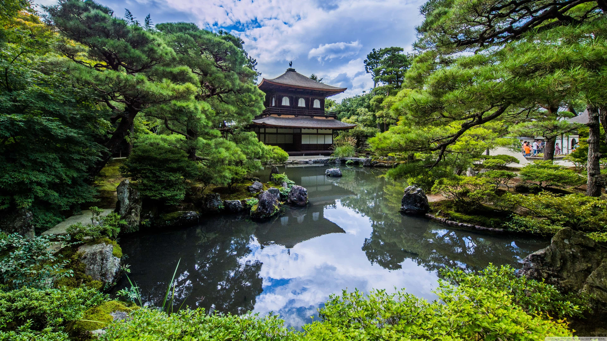

<!-- _class: invert -->

# <!-- fit --> よくわかる画像の話

---

# Shogo SENSUI ([shogosensui.com](https://shogosensui.com))

---

# 画像の存在

- 写真・ロゴ・アイコンなど、プラットフォームを問わず至る所で使われている
- 印象的な画像はユーザーの目を引き、時に重要な情報を伝える
- **画像はサービスにとって重要な存在** である

---

<!-- _class: invert -->

# <!-- fit -->そもそも画像ってなんだろう？

---

# 少し噛み砕いてみる

- RGB の表現系からなる画素の集合 (=ビットマップ) であるラスタ形式やベクタ形式
- よく使われる画像フォーマットは、PNG・JPEG・GIF・WebP・AVIF・SVG
- それぞれ特徴があるが、基本的にはラスターやベクターのデータを圧縮したもの

---

# [PNG](https://ja.wikipedia.org/wiki/Portable_Network_Graphics) (`image/png`)

- [フルカラー](https://ja.wikipedia.org/wiki/フルカラー)に加えてアルファチャネルを表現できる
- 通常の 24bit に加えて [8bit モードが存在](https://www.youtube.com/watch?v=bPdkWJe9XH0)
- 可逆圧縮

---

# [JPEG](https://ja.wikipedia.org/wiki/JPEG) (`image/jpeg`)

- フルカラーを表現できる
- プログレッシブ or ベースライン
- 非可逆圧縮

---

# [GIF](https://ja.wikipedia.org/wiki/Graphics_Interchange_Format) (`image/gif`)

- 256色を表現かつ特定色を透過できる
- アニメーション可能

---

# [WebP](https://ja.wikipedia.org/wiki/WebP) (`image/webp`)

- [WebM](https://ja.wikipedia.org/wiki/WebM) という動画圧縮コーデックの基礎
- [フルカラー](https://ja.wikipedia.org/wiki/フルカラー)に加えてアルファチャネルを表現できる
- 可逆圧縮と非可逆圧縮をサポート
- アニメーション可能

---

# [AVIF](https://ja.wikipedia.org/wiki/AVIF) (`image/avif`)

- [AV1](https://ja.wikipedia.org/wiki/AV1) という動画圧縮コーデックの基礎
- [フルカラー](https://ja.wikipedia.org/wiki/フルカラー)に加えてアルファチャネルを表現できる
- 可逆圧縮と非可逆圧縮をサポート
- アニメーション可能

---

# [SVG](https://ja.wikipedia.org/wiki/Scalable_Vector_Graphics) (`image/svg+xml`)

- パスを表現できるベクター形式の画像
- XML でありテキストデータ

---

<!-- _class: invert -->

# 特徴を踏まえた画像フォーマットの選択

- _PNG_: UI パーツやアイコンであれば SVG、他の場面では WebP / AVIF で代替
- **JPEG**: 写真やグラデーションを含むような複雑で非透過な画像
- _GIF_: アニメーションなら動画や WebP / AVIF で代替
- **WebP**: [WebP をサポートしている環境](https://caniuse.com/webp)の場合
- **AVIF**: [AVIF をサポートしている環境](https://caniuse.com/avif)の場合
- **SVG**: UI パーツ・アイコンのように色数が少なく透過がある場合

---

# 画像のファイルサイズの影響

- インターネットの帯域に加えて、端末のストレージやメモリ消費に影響する
- こと [Web においては、帯域の 80% を画像データが占めている](https://httparchive.org/reports/state-of-images)
- 同等の表現ができれば、軽いほど良い

---

<!-- _class: invert -->

# <!-- fit --> 今から 4 枚の JPEG と 1 枚の PNG をお見せします

---

<!-- _class: invert -->

## JPEG (オリジナル, 4.7MB)

---

<!-- _class: invert -->

## JPEG (圧縮率 80, 1.8MB)

---

<!-- _class: invert -->

## JPEG (圧縮率 60, 1.1MB)

---

<!-- _class: invert -->

## JPEG (圧縮率 40, 0.8MB)

---

<!-- _class: invert -->

## PNG (18.8MB)

---

# 画像の圧縮率とファイルサイズの関係

|   | ファイルサイズ | サイズ比率 |
|---|---|---|
| JPEG (オリジナル) | 4.7MB | 100% |
| JPEG (圧縮率80) | 1.8MB | 38% |
| JPEG (圧縮率60) | 1.1MB | 23.6% |
| JPEG (圧縮率40) | 0.8MB | 16.9% |
| PNG | 18.8MB | 400% |

- ファイルサイズは **縦横サイズより適切な圧縮 (=最適化)** に左右される
- 最適化された上であれば、縦横サイズが小さい方がファイルサイズは小さい

---

# 画像を適切に扱う心構え

- 開発者が適切な画像形式を選択し最適化するのは前提であり最低条件
- プロダクトがユーザーに強いるのは非現実的である
  - **PNG の写真をサーバーに送信されても文句は言えない**
- 故に **アプリケーション側で吸収する必要がある**
  - アップロードやダウンロード時に PNG を JPEG に変換する等

---

# 画像最適化ツール

- [**Squoosh**](https://squoosh.app/): [PNG](#6) / [JPEG](#7) / [WebP](#9) / [AVIF](#10) を相互変換し、最適化する
- [**ImageOptim**](https://imageoptim.com/mac): JPEG / PNG / [GIF](#8) を最適化する
- [**ImageAlpha**](https://pngmini.com/): PNG を 8bit へダウンコンバートする
- (archived) [**WebPonize**](https://github.com/webponize/webponize): JPEG / PNG を WebP に変換する
