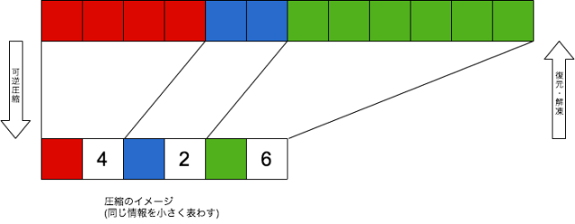
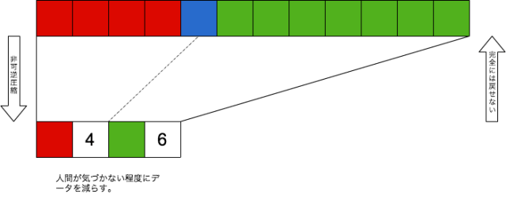

<!-- _class: invert -->

# <!-- fit --> よくわかる画像の話

---

# @1000ch

> Web アプリケーション開発を専門とするソフトウェアエンジニア。企業で働く傍ら、技術顧問として複数企業のエンジニアリングに関わり、高品質で維持しやすい Web アプリケーションを作るための活動を続けている。

---

# 画像の存在

- 写真・ロゴ・アイコンなど、プラットフォームを問わず至る所で使われている
- 印象的な画像はユーザーの目を引き、時に重要な情報を伝える
- **画像はサービスにとって重要な存在** である

---

<!-- _class: invert -->

# そもそも画像ってなんだろう？

---

# 少し噛み砕いてみる

- RGBの表現系からなる画素の集合（＝ビットマップ）
- よく使われる画像フォーマットは、PNG・JPEG・GIF・WebP
- それぞれ特徴があるが、基本的には画素の集合を圧縮したもの

---

# PNG

- フルカラー＋アルファチャネル
- 8bitモード（インデックスカラー）
- 可逆圧縮

※フルカラーは約1677万色（赤256×緑256×青256）

---

# JPEG

- フルカラー
- プログレッシブ or ベースライン
- 非可逆圧縮

---

# GIF

- 256色＋特定色の透過
- アニメーション

---

# WebP

- フルカラー＋アルファチャネル
- 可逆圧縮・非可逆圧縮
- アニメーション

---

<!-- _class: invert -->

# 特徴を踏まえた画像フォーマットの選択

- **PNG**: UIパーツ・アイコンのように色数が少なく透過がある
- **JPEG**: 写真やグラデーションを含むような複雑で非透過な画像
- **GIF**: アニメーションをさせたい場合
- **WebP**: WebPをサポートしている環境の場合

---

## 画像ファイルのサイズ

- 通信コスト、ストレージやメモリ消費に影響する
- ことWebに関しては、帯域の80%を画像データが占めている
- 同等の表現ができれば、軽いほど良い

---

<!-- _class: invert -->

# <!-- fit --> 今から 4 枚の JPEG と 1 枚の PNG をお見せします

---

<!-- _class: invert -->

## JPEG（4.7MB）

---

<!-- _class: invert -->

## JPEG（1.8MB）

---

<!-- _class: invert -->

## JPEG（1.1MB）

---

<!-- _class: invert -->

## JPEG（0.8MB）

---

<!-- _class: invert -->

## PNG（18.8MB）

---

# 圧縮率とファイルサイズの関係

- オリジナル: **4.7MB**（100%）
- 圧縮率80: **1.8MB**（38%）
- 圧縮率60: **1.1MB**（23.6%）
- 圧縮率40: **0.8MB**（16.9%）
- PNGに変換したもの: **18.8MB**（400%）

ファイルサイズは **縦横が小さいかより圧縮がされているか** に左右される（もちろん最適化された上であれば、縦横サイズが小さい＝ピクセル数が少ないほうがファイルサイズは小さくなる）

---

# 画像を適切に扱うためにサービス提供側ができる努力

- 開発側が適切な画像フォーマットを選択し圧縮・最適化するのは、前提であり最低条件
- ユーザーに強いるのは非現実的（**PNGの写真をサーバーに送信されても文句は言えない**）
- **アプリケーション側で吸収する必要がある**（アップロード時・配信時などにPNGをJPEGに変換する等）

---

# 画像最適化ツール

- [ImageOptim](https://imageoptim.com/mac): JPEG・PNG・GIFを最適化する
- [ImageAlpha](https://pngmini.com/): PNGの8bitにダウンコンバートする
- [JPEGmini](http://www.jpegmini.com/): JPEGを圧縮・最適化する
- [WebPonize](https://github.com/webponize/webponize): JPEG・PNGをWebPに変換する

---

# 参考資料

- [Give PNG a chance](http://article.enja.io/articles/give-png-a-chance.html)
- [We should optimize images](https://medium.com/@1000ch/we-should-optimize-images-8435760e0ec9)
- [Introduction to WebP](https://medium.com/@1000ch/introduction-to-webp-b593dfe1d1d1)
