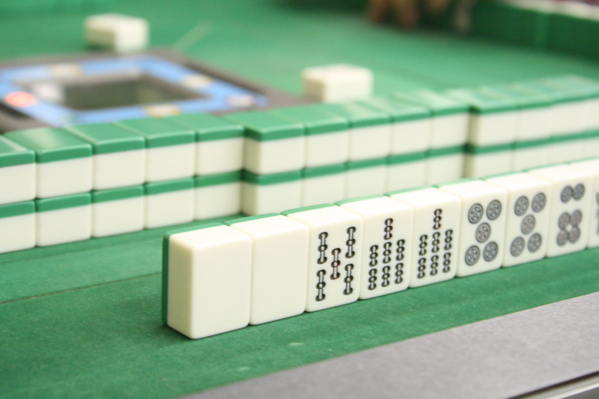

<!-- _class: invert -->

# 麻雀はじめの一歩

by [@1000ch](http://twitter.com/1000ch)

---

## 麻雀とは？

4人のプレイヤーがテーブルを囲み136枚の牌を用いて手役を揃えるテーブルゲーム。手役の難易度に応じて得点をやりとりし、最終的に持ち点が高い人が勝利する。

---

<!-- _class: invert -->

# 麻雀牌の種類

---

<!-- _header: 麻雀牌の種類 -->

## 萬子 (マンズ)

---

<!-- _header: 麻雀牌の種類 -->

## 筒子（ピンズ）

---

<!-- _header: 麻雀牌の種類 -->

## 索子（ソーズ）

---

<!-- _header: 麻雀牌の種類 -->

## 字牌（ツーパイ）

---

<!-- _class: invert -->

# ルールがわからない人がはじめに覚えるべき基本原則

---

## 基本原則その1「アガリ形」

- アガリ形は14枚である
- 手元に13枚、自摸って14枚という流れを繰り返し行う
- **雀頭(2枚1組)が1つ** ＋ **面子(3枚1組)が4つ** という内訳

<small>※いずれも特殊なケース(七対子・国士無双・四槓子・十三不塔など)を除く</small>

---

## 基本原則その2「面子と雀頭」

- 雀頭（同じ牌が2つの組み合わせ）
    -  とか  とか
- 順子（同じ種類の牌で数字が3つ連続している組み合わせ）
    -  とか  とか
- 暗刻（同じ牌が3つの組み合わせ）
    -  とか  とか

---

## ここまでが最低限

何とか遊べる。でも、あがれない。

---

## アガるためには「役」が必要

- 牌の揃い方によって **役** が発生する
- 難易度が高ければ高い程、役の数は大きくなる
- 役は複合して発生することもある

ポーカーをイメージするとわかりやすいかも。 **ストレートとかフラッシュといった役があって、複合していればストレートフラッシュになる** 、みたいな。

---

<!-- _class: invert -->

# ルールがわからない人が覚えるべき5つの役

---

## 立直（リーチ）

あと1手でアガリという聴牌（テンパイ）の状態で、宣言する

---

## 断么九（タンヤオ）

1と9と字牌を含めずにアガる

---

## 平和（ピンフ）

順子で構成し、両面待ちでアガる

---

## 七対子（チートイツ）

対子を7つ構成する

---

## 混一色（ホンイーソー）

萬子・筒子・索子いずれかと字牌のみで構成する

---

## ひとまずこの5つを覚えよう

- ポン？チー？カン？そんなもんやらんでいい！
    - やりたい人は **翻牌（ファンパイ）** という役を覚えてからやること
- ドラ？そんなもん（最初は）気にしなくていい！
- 点数の数え方？そんなもん（最初は）気にしなくていい！

---

<!-- _class: invert -->

# 少しだけ実践的な話

アガるために出来るだけ効率良く面子を作りたい

---

これらはいずれも残り1枚で面子が構成される

　　　

---

ちなみにこういう呼び名

　リャンメン（両面）

　カンチャン（嵌張）

　ペンチャン（辺張）

　シャンポン（双碰）

---

同じ牌は4枚しかないことを思い出すと…

　

　

　

　

---

## 両面最強

 ＞  ＞  ＞ 

---

## 嵌張＞辺張？

 ＞ 

---

## 面子になる牌の数は同じだが

　

　

---

## より良い形に変化しやすい

なら…

を引けばで面子になる

を引けばで両面になる

を引けばで両嵌になる

---

# まとめ

- 4面子1雀頭が和了の基本形
    - 手元に13枚・自摸って14枚を繰り返す
- アガるには「役」が必要
    - 紹介した5つを最低覚えたい
- 如何に他家より早く和了するか
- あとはひたすらゲームをやってみる
