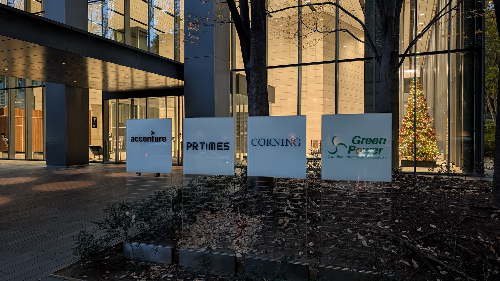

<!-- _class: invert -->

# <!-- fit --> 三年間の関わりから見る PR TIMES エンジニアリングの変化

---

## Shogo SENSUI ([shogosensui.com](https://shogosensui.com))

- Advisor at PR TIMES, Inc.
- Advisor at Macromill, Inc.
- Advisor at JR West

---

<blockquote class="twitter-tweet">
X の皆さんご無沙汰しています。<a href="https://twitter.com/PRTIMES_JP?ref_src=twsrc%5Etfw">@PRTIMES_JP</a> での支援が始まって早三年が経ったので、書きました📝 / “三年間の関わりから見る PR TIMES エンジニアリングの変化 | PR TIMES 開発者ブログ” <a href="https://t.co/iVLE8npJRn">https://t.co/iVLE8npJRn</a>
&mdash; Shogo SENSUI 🍵 (@1000ch) <a href="https://twitter.com/1000ch/status/1838741563188613246?ref_src=twsrc%5Etfw">September 25, 2024</a></blockquote>

---

# <!-- fit --> 遡ること 2021 年

---

# 機能追加もままならないプロダクト

- レガシーでモノリスな PHP に jQuery で振る舞いを実装した古き良き Web アプリ
- クラウドではなくオンプレでホストされ、CI/CD も組まれていないシステム
- **Frontend/Backend どうこう以前に、エンジニアリングの方向性が示されていない**

---

# エンジニアリングの梃入れに伴い参画

- 現 CTO が参画し、[セキュリティを優先にシステム課題および優先度の明確化](https://developers.prtimes.jp/2021/04/23/goals_dev_div/)
- 古い PHP のアップグレードや React の導入など、大まかな方向性が決定
- 2021 年の夏頃に依頼があり、Frontend を中心にサポートを開始

---

# <!-- fit --> 状況の把握と支援の模索

---

## 未開拓のシステム

- 古く大きな PHP に jQuery で実装された Frontend 実装を開拓
- [React を部分的に導入した](https://developers.prtimes.jp/2021/11/10/replace-react/)ものの、先々の方向性は不明確な状態

## 未成熟のチーム

- この状況に置かれた、所謂 Frontend なソフトウェアエンジニアは新卒 3 人
- 「アドバイザーらしき人が来たらしいが、どう協調すれば良いかわからない」

---

## Frontend 領域の確立に向けたチーミング

- まずは[継続的に対話する場を設け](https://developers.prtimes.jp/2022/12/26/frontend-mtg/)、何が起きて何に困っているのかを把握分析
- とにかく自己開示の機会を増やし、領域内外の関係構築を促進

## 「やりたい」で終わらない課題解決に向けて

- 課題の解像度を高め、取捨選択を繰り返すように議論を補助
- 個人の WANT ではなく組織の SHOULD、短期ではなく中長期を優先

---

<!-- _class: invert -->
<!-- _header: これが伴わないアイデアは、考えることを放棄した思い付き -->

# 唯一やった型化「背景 → 課題 → 提案」

- 1️⃣現状を整理して俯瞰 2️⃣抽象度を高めた課題を抽出 3️⃣課題の対処方法を考案
- 如何なる課題解決にも適用できる思考の基本でありフレームワーク
- 起案のフォーマットとし、議論を繰り返す。これで議論の質が徐々に向上

---

# <!-- fit --> 取り組みが徐々に結実

---

## Backend と同居していた Frontend 実装を別リポジトリに分離

<blockquote class="twitter-tweet">
レガシーな実装だった PR TIMES のフロントエンドが徐々に、そして着実に改善されている。モダン化に向けて一気に修正することが難しい中で、このフロントエンドを切り離す一手の意義は大きい。 / “PR TIMESにおけるフロントエンド開発基盤の構築 | PR TIMES 開発者ブログ” <a href="https://t.co/qbwQPvDhjI">https://t.co/qbwQPvDhjI</a>
&mdash; Shogo SENSUI 🍵 (@1000ch) <a href="https://twitter.com/1000ch/status/1514417828954210308?ref_src=twsrc%5Etfw">April 14, 2022</a></blockquote>

---

## 正解のない議論に時間を費やしていた ESLint による lint を xo へ置換

<blockquote class="twitter-tweet">
みんなでコツコツ進めて、ようやく適用完了した。しっかり目のルールをこの行数のファイルに適用できたのは凄い😅確かにフルスキャンは重いけど、基本はテキストエディタの拡張機能と、変更差分に適用できれば大丈夫そう <a href="https://t.co/qafy33xcCe">https://t.co/qafy33xcCe</a>
&mdash; Shogo SENSUI 🍵 (@1000ch) <a href="https://twitter.com/1000ch/status/1755954694093238737?ref_src=twsrc%5Etfw">February 9, 2024</a></blockquote>

---

<!-- _header: Output/Outcome -->

# Frontend で積み重ねた改善の数々

- [Frontend の実装を集約するリポジトリを作成し、分割統治](https://developers.prtimes.jp/2022/04/14/web-front-end-development-enviroment-in-prtimes-inc/)
- webpack によるビルドを [esbuild を経て](https://developers.prtimes.jp/2022/06/01/build-time-improvements-using-esbuild/) [Vite に移行](https://developers.prtimes.jp/2023/02/08/migrate-from-webpack-to-vite/)し、高速化
- 終わりのないルールの議論に時間を割いていた [ESLint から xo へ移行](https://developers.prtimes.jp/2024/02/09/frontend-lint-tools-unified-xo/)
- Frontend が支配的だった [GitHub Actions の実行時間を分析し改善](https://developers.prtimes.jp/2024/02/16/github-actions-frontend/)

---

<!-- _header: Outcome/Outgrowth -->

# ソフトウェア以外の副次的な変化や成長

- 仲間も増えて Frontend という技術領域が確立し、経験だけでなく信任が蓄積
  - [バックエンドエンジニアがフロントエンド開発](https://developers.prtimes.jp/2024/09/06/frontend-challenge-learnings/)・[フロントエンドエンジニアがバックエンド開発](https://developers.prtimes.jp/2024/11/12/backend-challenge-learnings/)に相互でコミット
- **課題の解像度を磨き続けた** ことで「やらなければ良かった」が体感的に減少
- 困難な状況下でも結果を積み重ねた自信が、**個人や組織としての主体性** に
  - 潜在的な技術負債を予め察知し対処できている
---

# <!-- fit --> まだ終わらない改善

---

# アドバイザーとしての支援を振り返った雑感

- 焦点はマインドセットや課題解決で、実のところ「The 技術」の提供は少ない
- 100 点の正解は持ち合わせていないし、劇的な課題解決からは程遠い
- それなりに重要な役割でありながら、（良い意味で）放任ベースだった
- 変化に相応の忍耐力が問われる中で、皆が根気よく向き合ってきた

---

# 個人や組織の更なる発展に向けて

- ✅ コミットの賜物で負債は着実に減っている
  - 🚧 アクセシビリティをはじめとした、更に発展的な非機能要件への取り組み
- ✅ 個人での頑張りから組織としての協調へ
  - 🚧 開発に留まらない、事業や採用などの領域への関心と観点の拡大

---

<!-- _header: キャリアの悩み、チームの課題、PR TIMES のこと、etc -->

# <!-- fit --> お気軽にお声がけください

