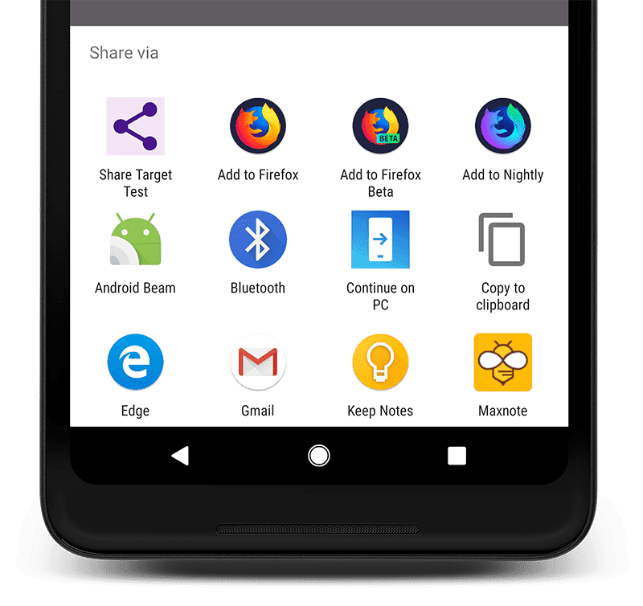

<!-- _class: invert -->

# <!-- fit --> Web Share API

---


## Shogo SENSUI ([shogosensui.com](https://shogosensui.com))

SIer での受託開発を経て、2012 年に株式会社サイバーエージェントに入社。プロダクト開発の傍ら、エンジニア組織のマネジメントに従事。2018 年に株式会社メルカリに入社後は、[株式会社メルペイの Frontend チームの立ち上げ](https://engineering.mercari.com/blog/entry/20201222-merpay-frontend/)や [Web 版の「メルカリ」の刷新](https://engineering.mercari.com/blog/entry/20210810-the-new-mercari-web/)、[メルカリアプリのコードベース刷新](https://engineering.mercari.com/blog/entry/20221213-ground-up-app/)を牽引した後に、執行役員 VP of Engineering としてメルペイのエンジニアリング部門を管掌。2023 年 4 月にデジタル庁入庁。2023 年 7 月に株式会社ハウテレビジョン入社、執行役員プロダクト本部長に就任。[mond 認定回答者](https://mond.how/1000ch)、[TechFeed 公認エキスパート](https://techfeed.io/people/@1000ch) (Web 標準技術 • JavaScript)。

---

# Web における共有の機能

## 従来はコピーさせるか URL ベースで実装

- 共有させたい文言を用意しておくなり、URL をコピーするなり

## [Web Intent](https://en.wikipedia.org/wiki/Web_Intents) の例

- X の例: `https://x.com/intent/tweet?text=Hello%20World!`
- はてなの例: `https://b.hatena.ne.jp/entry/s/1000ch.net`

---

# 従来の Web Intent の課題

## 共有先をコントロールできない

- リンクを貼れば良いので至ってシンプル、しかし共有したい先は利用者に依存する
- X の Web Intent が設置されていても、Bluesky に共有しやすいわけではない

## URL である以上ナビゲーションを伴う

- できれば画面遷移せずに機能を実現したい
- 「連携先の認証情報を持って自動で投稿」などは、実装上の複雑性が大きい

---

# Web Share API

- OS と連動しアプリを跨いで「タイトル・テキスト・URL・ファイル」を、サポートするアプリに共有できる
- [Android/iOS の主要ブラウザでサポート](https://caniuse.com/web-share)されている



---

<!-- _header: Web Share API -->

```javascript
button.addEventListener('click', async () => {
  try {
    const data = {
      title: 'MDN',
      text: 'Learn web development on MDN!',
      url: 'https://developer.mozilla.org',
    };

    if (navigator.canShare?.(data)) {
      await navigator.share(data);
    } else {
      console.log(`Couldn't share data`);
    }
  } catch (error) {
    console.error(error);
  }
});
```

---

<div class="mermaid">
flowchart TB
subgraph os[OS]
  subgraph browser[ブラウザ]
    webapp[Web アプリケーション]
  end
  subgraph app1[アプリケーション]
    receiver1[text と url を受け取る機能]
  end
  subgraph app2[アプリケーション]
    receiver2[text と files を受け取る機能]
  end
  webapp --text, url--> receiver1
  webapp --text, files--> receiver2
end
</div>

---

# Web Share Target API

## PWA もアプリとして受け取れる

- モバイル OS の PWA であれば、Web Share API の対象として扱われる
- 画像ファイルを受けとる [Squoosh](https://squoosh.app) やテキストを受け取る [X](https://x.com) など

## Web app manifest の一部

- [`share_target`](https://developer.mozilla.org/ja/docs/Web/Manifest/share_target) に「どのデータを受け取り、何をトリガーするか」を指定する

---

<!-- _header: Web app manifest の share_target プロパティ -->

```json
{
  "share_target": {
    "action": "/shared-content-receiver/",
    "method": "GET",
    "params": {
      "title": "name",
      "text": "description",
      "url": "link"
    }
  }
}
```

<script type="module">
import mermaid from 'https://unpkg.com/mermaid@10/dist/mermaid.esm.min.mjs';
mermaid.initialize({startOnLoad: true});
</script>
<script defer src="https://platform.x.com/widgets.js"></script>

