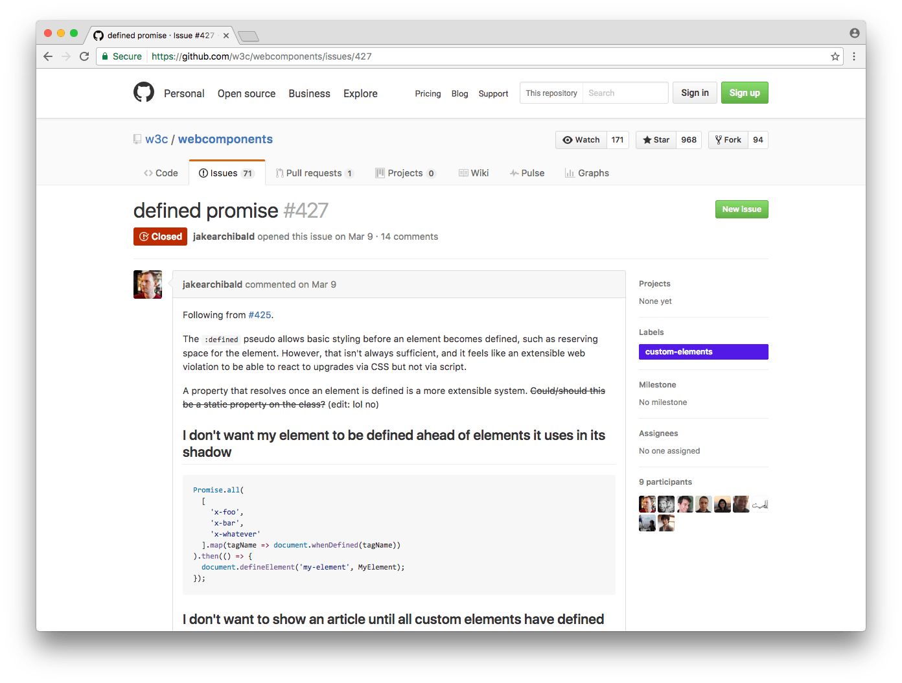

<!-- _class: invert -->

# <!-- fit --> Web Components 2016 & Polymer v2

2016.10.09 [DevFest Tokyo 2016](http://gdg-tokyo.connpass.com/event/38927/)

---


# @1000ch

> Web アプリケーション開発を専門とするソフトウェアエンジニア。企業で働く傍ら、様々な企業のエンジニアリングに顧問として関わり、高品質で維持しやすい Web アプリケーションを作るための活動を続けている。

---

# アジェンダ

- Web Components おさらい
- 最近の Web Components 事情
- Polymer v2 is coming!!

---

<!-- _class: invert -->

# <!-- fit -->　Web Components のおさらい

---


<!-- _class: invert -->

# 「Web におけるコンポーネント」の難しさ

長らく Web 開発者が向き合ってきた

---

## 再利用可能な Web のコンポーネント

- それを **作る難しさ** と **使うコスト**
- 特定のライブラリへの依存問題
- エコシステムが醸成されない問題
- 容赦なくグローバルを汚染する問題

---

## CSS だけはどうにもならない

<blockquote class="twitter-tweet" data-lang="ja"><p lang="und" dir="ltr">(╯°□°）╯︵ SSƆ</p>&mdash; 1000ch (@1000ch) <a href="https://twitter.com/1000ch/status/752394739438137344">2016年7月11日</a></blockquote>

CSS はつらい。本当につらい。

---

## Web 標準技術を組み合わせて実現する（重要）

- アプローチはどれも特定のツールや手法に依存してきた
- **Web のコンポーネント** を作る手法が一般化される
- 「そうだ、 [Extensible Web](http://jxck.hatenablog.com/entry/extendthewebforward) だ」

---

## Web Components を支える技術

- [Custom Elements](https://www.w3.org/TR/custom-elements/): 新たな要素の定義
- [Shadow DOM](https://www.w3.org/TR/shadow-dom/): 隔離された DOM スコープ
- [HTML Imports](https://www.w3.org/TR/html-imports/): 断片化した HTML のロード
- [Templates](https://www.w3.org/TR/html5/scripting-1.html#the-template-element): 不活性な HTML 要素

---

<!-- _class: invert -->

# <!-- fit --> 最近の Web Components 事情

---

## Shadow DOM v1 と Custom Elements v1

これまでのものを v0、新たなものを v1 として、改めて仕様の策定が進んでいる

---

## Shadow DOM v1

- `createShadowRoot()` から `attachShadow()` へ
- Opened な Shadow DOM と Closed な Shadow DOM
- 複数 `Shadow Root` の廃止
- [Shadow Root をホストできる要素が限定的に](https://dom.spec.whatwg.org/#dom-element-attachshadow)
- `<content>` から `<slot>` へ

---

## `createShadowRoot()` から `attachShadow()` へ

```javascript
const div = document.querySelector('div');
const shadowRoot = div.attachShadow({
  mode: 'open' // or 'close'
});

// readonly な shadowRoot プロパティの追加
console.log(div.shadowRoot);
```

引数に open か close かどうかを指定する（必須）

---

## Opened Shadow DOM と Closed Shadow DOM

外部からアクセスできる Shadow DOM と、アクセスできない Shadow DOM。 Closed Shadow DOM であれば `shadowRoot` プロパティは `null` を返す

---

## 複数 `Shadow Root` の廃止

> Though multiple shadow roots were originally introduced to support an Inheritance Model for components, Blink has already deprecated this feature even in v0. Do not use multiple shadow roots.

ある要素の `attachShadow()` を2回以上実行すると例外が発生する

---

## 制限された Shadow Host になれる要素

`article`, `aside`, `blockquote`, `body`, `div`, `footer`, `h1`, `h2`, `h3`, `h4`, `h5`, `h6`, `header`, `nav`, `p`, `section`, `span`

---

## `<content>` から `<slot>` へ

`<content>` で指定していた Insertion Points は、 `<slot>` に代わり Slots と表現されるようになる。セレクタで指定していたのが、 `<slot name=slot-name>` のような[スロット名の完全一致で挿入される](http://codepen.io/1000ch/pen/ALVkYX)。

---

## `<content` による挿入から

```html
<template>
  <style>
    ::content input { background: skyblue; }
  </style>
  <div>
    <content select=".class-name"></content>
    <content></content>
  </div>
</template>

<form-container>
  <input class="class-name" type="text">
  <button>Button</button>
</form-container>
```

---

## `<slot>` による挿入へ

```html
<template>
  <style>
    ::slotted(input) { background: skyblue; }
  </style>
  <div>
    <slot name="slot-name"></slot>
    <slot></slot>
  </div>
</template>

<form-container>
  <input slot="slot-name" type="text">
  <button>Button</button>
</form-container>
```

---

## [What's New in Shadow DOM v1 (by examples)](http://hayato.io/2016/shadowdomv1/)

更なる詳細はこちらの資料を参照のこと

---

## Custom Elements v1

- ES2015 class ベースの要素定義
- ライフサイクルコールバックの見直し
- `document.registerElement` から `window.customElements` へ

---

## Custom Elements v0

```html
<script>
  const FooElement = Object.create(HTMLElement.prototype);
  FooElement.createdCallback = () => { ... };
  FooElement.attachedCallback = () => { ... };
  FooElement.detachedCallback = () => { ... };
  FooElement.attributeChangedCallback = () => { ... };

  document.registerElement('foo-element', {
    prototype: FooElement
  });
</script>
```

---

## Custom Elements v1

```html
<script>
  class FooElement extends HTMLElement {
    constructor() { ... }
    connectedCallback() { ... }
    disconnectedCallback() { ... }
    attributeChangedCallback() { ... }
    adoptedCallback() { ... }
  }

  window.customElements.define('foo-element', FooElement);
</script>
```

---

## `window.customElements`

```javascript
// <foo-element> コンストラクタの参照
const FooElement = customElements.get('foo-element');

// <foo-element> が定義されたタイミング
customElements.whenDefined('foo-element').then(() => {
  console.log('foo-element is defined');
});
```

---



<!-- _class: invert -->

## カスタム要素が定義されるタイミングを待ちたい？

不完全な状態でページが表示されるのを避けるには、 `:defined` 擬似クラスだけでは難しい

[Issue #427 · w3c/webcomponents](https://github.com/w3c/webcomponents/issues/427)

---

## `is` 属性の行方…

今のところ WebKit は `<button is="foo-button" />` のような [Custom Elements によるネイティブ要素の拡張をしない方針](https://github.com/w3c/webcomponents/issues/509#issuecomment-233419167)を示している

---

## HTML Imports はどうなった

Mozilla は [ES6 Modules を意識して見送っている](https://hacks.mozilla.org/2014/12/mozilla-and-web-components/)。[The state of Web Components](https://hacks.mozilla.org/2015/06/the-state-of-web-components/) でも触れているように、ES Modules で解決することを支持している

---


<!-- _class: invert -->

## ブラウザサポート状況

- **Shadow DOM v0**: Chrome, Firefox w/flag, Safari 10, Opera
- **Shadow DOM v1**: Chrome 53, Opera 40, Safari 10
- **Custom Elements v0**: Chrome, Firefox w/flag, Opera
- **Custom Elements v1**: Chrome 54, Opera 41, Safari TP 14
- **HTML Imports**: Chrome, Firefox w/flag, Opera
- **Templates**: Chrome, Firefox, Safari, Opera, Edge

---

## Safari 10 に Shadow DOM v1 が実装された！

[iOS 10 のシェア](https://mixpanel.com/trends/#report/ios_10/from_date:-3,report_unit:hour,to_date:0)次第だが、時間の問題

---


---

## Safari TP 14 に Custom Elements v1 が実装された (❗❗)

_メニューの Develop → Experimental Features → Custom Elements_

---


---

## Safari の実装が進むことは、開発者にとってかなり大きい

- モバイルでの利用は現実的になってきた😍
- あとは Firefox と Edge を応援するだけ👆
- IE... (´・ω・`).;:...(´・ω...:.;::..(´・;::: .:.;: ...

---

## Edgeに実装を進めてもらおう

みんなで [Shadow DOM (unprefixed)](https://wpdev.uservoice.com/forums/257854-microsoft-edge-developer/suggestions/6263785-shadow-dom-unprefixed) と [Custom Elements](https://wpdev.uservoice.com/forums/257854-microsoft-edge-developer/suggestions/6261298-custom-elements) に投票しよう！

---


<!-- _class: invert -->

# Polymer v2 is coming !!

---


<!-- _class: invert -->

## Polymer 2.0 Preview

<blockquote class="twitter-tweet" data-lang="ja"><p lang="en" dir="ltr">Polymer 2.0 is just starting to come together. For a very early look at what&#39;s coming, check out: <a href="https://t.co/w6U7L4I0OZ">https://t.co/w6U7L4I0OZ</a></p>&mdash; Polymer (@polymer) <a href="https://twitter.com/polymer/status/774379113666654208">2016年9月9日</a></blockquote>

[Polymer/polymer](https://github.com/Polymer/polymer) リポジトリの `2.0-preview` ブランチ

---


<!-- _class: invert -->

## 日本語訳

<blockquote class="twitter-tweet" data-lang="ja"><p lang="ja" dir="ltr">Polymer 2.0 Preview が公開されていますが、その時のアナウンス内容を日本語訳してみました。興味のある方はぜひお読みください。 <a href="https://t.co/Y9EEERPKCR">https://t.co/Y9EEERPKCR</a> <a href="https://twitter.com/hashtag/polymer?src=hash">#polymer</a> <a href="https://twitter.com/hashtag/html5j?src=hash">#html5j</a></p>&mdash; Yoichiro Tanaka (@yoichiro) <a href="https://twitter.com/yoichiro/status/779830672693207041">2016年9月24日</a></blockquote>

---


<!-- _class: invert -->

<blockquote class="twitter-tweet" data-lang="ja"><p lang="en" dir="ltr">Polymer Summit 2016 registration is now open! Join us in London on October 17-18. <a href="https://t.co/gWSEOpy3Sb">https://t.co/gWSEOpy3Sb</a> <a href="https://t.co/Noj4kAsdqd">pic.twitter.com/Noj4kAsdqd</a></p>&mdash; Polymer (@polymer) <a href="https://twitter.com/polymer/status/765254100300603393">2016年8月15日</a></blockquote>

[Polymer Summit 2016](https://www.polymer-project.org/summit/) in London on October 17-18

---

## Polymer v2 のロードマップ

- Web Components **"v1"** の機能のフルサポート
- Polymer `v1.x` からのスムースなマイグレーション
- 標準にそぐわない "leaky" な抽象化を排除
- Polymer 内部のデータシステムの改善

---

## Polymer v1.x

```javascript
const MyElement = Polymer({
  is: 'my-element',
  created: function () {},
  attached: function() {},
  detached: function() {},
  attributeChanged: function() {},
  ready: function() {}
});
```

---

## Polymer v2

```javascript
class MyElement extends Polymer.Element {
  static get is() { return 'my-element'; }
  static get config() {
    return { /* properties, observers meta data */ };
  }
  constructor() { super(); }
  connectedCallback() { super.connectedCallback(); }
}

customElements.define(MyElement.is, MyElement);
```

---

## Polymer v1.x の API も一応使える

`polymer.html` が引き続き提供され、`Polymer.dom()` や `Polymer.CompatElement` といった Polymer v1.x で提供されてきた API も含まれる

---

## ネイティブ API へ移行を強く推奨

Polymer で抽象化してきた API が排除されネイティブの API を使うように。例えば、[Shady DOM v1](https://github.com/webcomponents/shadydom) が提供されることで DOM 操作に関しても `Polymer.dom()` が不要になる

---

## Polymer v2 は `is=""` をサポートしない

Polymer v1.x の機能は引き続き提供されるが、Type Extension (`is="..."`) の雲行きが怪しいので…

```html
<dom-repeat items="{{items}}">
  <template>...</template>
</dom-repeat>

<custom-style>
  <style>...</style>
</custom-style>
```

---

<!-- _class: invert -->

## Web Components "v1" の API に依存する

故に、サポートされていない環境で使うには [webcomponentsjs](https://github.com/webcomponents/webcomponentsjs) によるポリフィルが必要である。そして新たなスペックに対応するポリフィルを提供する [v1 ブランチ](https://github.com/webcomponents/webcomponentsjs/tree/v1)の開発が進められている

---


<!-- _class: invert -->

## [Polymer Elements](https://elements.polymer-project.org/)

v2 のリリースに伴いアップデートされるが、使う側に影響はない（はず）

---

## Polymer v2-preview を今すぐ試したい？

```html
$ bower install --save Polymer/polymer#2.0-preview
```

---

<!-- _class: invert -->

# まとめ

---

<!-- _header: まとめ -->

## スペックに関して

- Shadow DOM v1 も Custom Elements v1 も順当にリデザインされてる
- Shadow DOM は既に [v2](https://github.com/w3c/webcomponents/labels/v2) に関する議論がはじまっている
- HTML Imports だけは先行きが若干不安だが、ひとまず [webcomponentsjs](https://github.com/webcomponents/webcomponentsjs) のポリフィルに頼る
- WebKit の実装進捗によって **モバイル利用が現実的になりつつある**

---

<!-- _header: まとめ -->

## 使い方に関して

- スコープを解決するためのツールは沢山でてきたが、ツールありきのアプローチでは可搬性が担保されない
- 今こそみんなで使っていこう（<del>流行らなければ過去の遺物になってしまう</del>）
- 開発の未来は <u>**C** omponent **D** riven **D** evelopment</u>

---


<!-- _class: invert -->

# <!-- fit --> おわり
