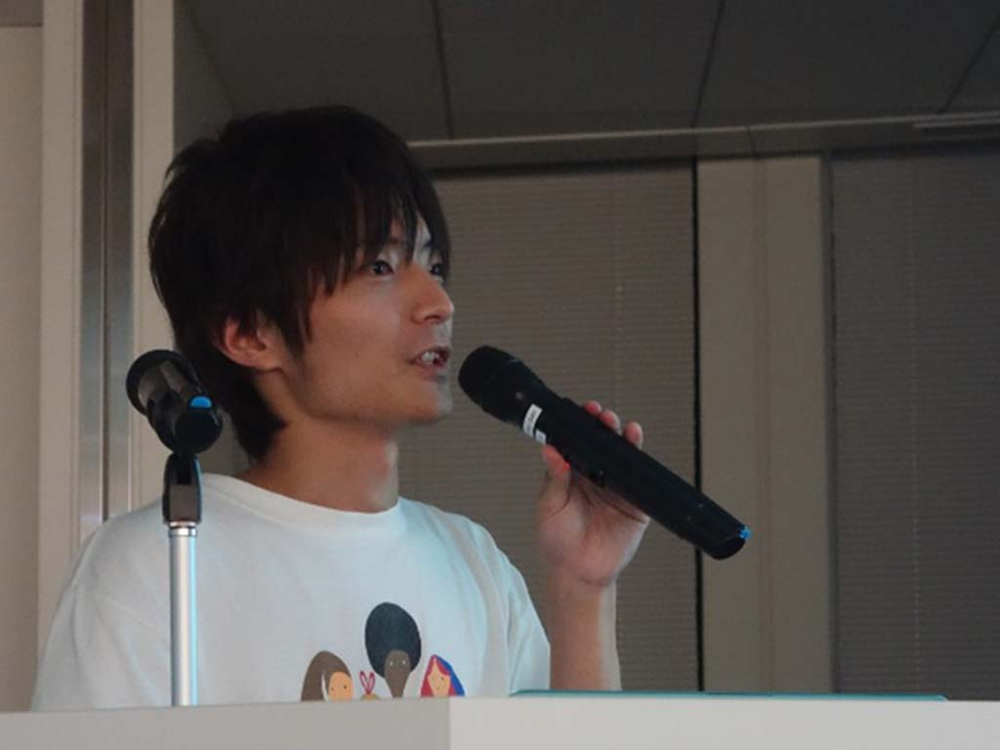
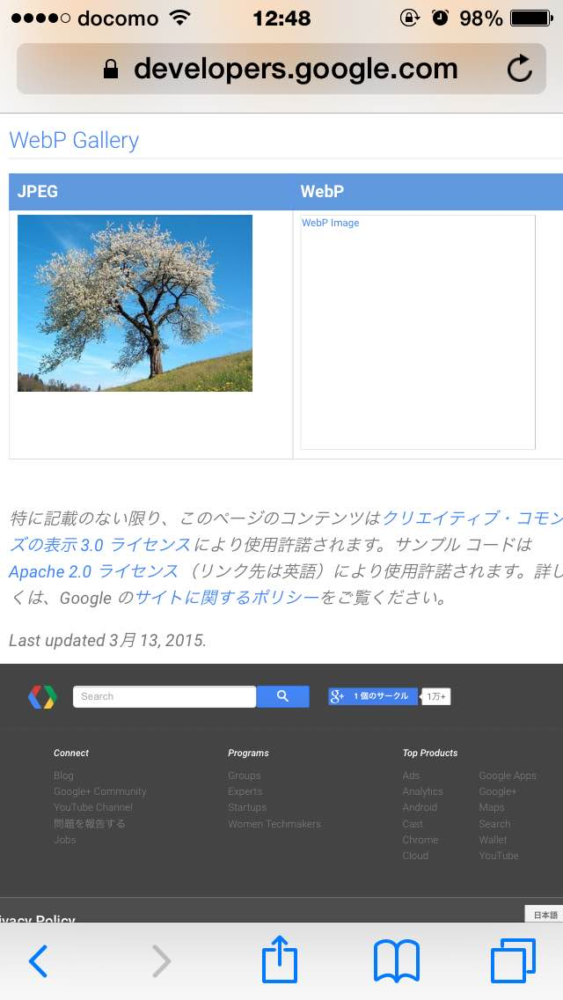
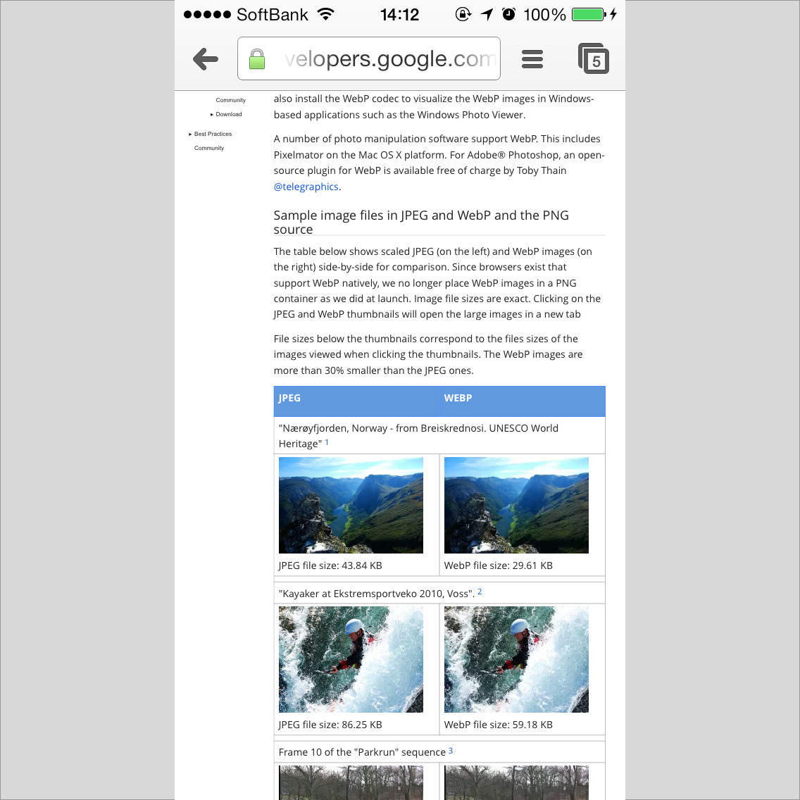
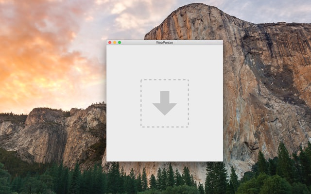

<!-- _class: invert -->

# Introduction to **WebP**

A new image format for the Web

by [@1000ch](http://twitter.com/1000ch)

---

## Who is 1000ch

- Software Engineer at CyberAgent
- [1000ch.net](http://1000ch.net)の人
- [HTML5Experts.jp エキスパート](http://html5experts.jp/1000ch)

---

## WebPとは？

- Googleが開発する新しい画像フォーマット
- 可逆/非可逆圧縮・アルファチャネル・アニメーション
- 高圧縮率でファイルサイズがとても軽い

---

## どのくらい軽いの？

- 可逆圧縮 → PNG比で約26%小さい
- 非可逆圧縮 → JPEG比で約25%~34%小さい
- アルファチャネル付きの非可逆圧縮 → PNG比で3倍以上小さい

---

### 1000ch.jpg (圧縮レベル80で33KB)



---

### 1000ch.webp (圧縮レベル80で15KB)


---

<!-- _class: invert -->

# 利用に向けて

---

## サポート環境

- Google Chrome (+ Opera)
- Chrome for Android <i class="fa fa-android"></i>
- Chrome for iOS
- CodecがあればWindowsのエクスプローラ <i class="fa fa-windows"></i>

---

### iOS Safariだと…



---

### iOS Chromeだと…



---

## iOS WebViewもOK

- vwebpで表示する
- dwebpでデコードする
- Chrome Frameを使う（サポート終了）

ネットワークコストの軽減＋アプリサイズのダイエット

---

## 非対応ブラウザのために

- WebPJSで`.webp`をdataURIに変換
- リクエストヘッダに`image/webp`がない場合はpngを返却
- `<picture>`と`<source type="image/webp">`で条件分岐

やりようはいくらでもある

---

<!-- _class: invert -->

# ツール

---

## コマンドラインツール

- [cwebp](https://developers.google.com/speed/webp/docs/precompiled) Homebrewからもインストール可
- [cwebp-bin](https://github.com/imagemin/cwebp-bin) cwebpのNode.jsラッパー
- [grunt-cwebp](https://github.com/1000ch/grunt-cwebp) Gruntプラグイン
- [gulp-cwebp](https://github.com/1000ch/gulp-cwebp) Gulpプラグイン

---

```bash
$ brew install cwebp
$ npm install [-g] cwebp-bin
$ npm install grunt-cwebp
$ npm install gulp-cwebp
```

---

## GUIでやりたい？

- [webp.herokuapp.com](http://webp.herokuapp.com) - Webツール
- [WebPonize](http://github.com/1000ch/webponize) - Macのアプリ

---

### WebPonize



Drag & Drop!

---

## WebPonize の機能

- ImageOptimにそっくりなUI
- ドラッグ&ドロップで変換できる
- 複数ファイルのドロップもOK
- PNG・JPEG・GIF（アニメーションGIF）に対応している
- 圧縮率やアルファチャネルのオプション設定できる

---

# Thank you!
