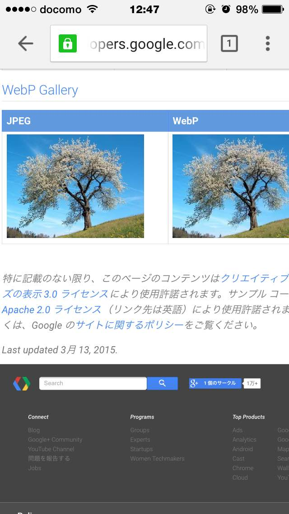

<!-- _class: invert -->

# <!-- fit --> Introduction to **WebP**

A new image format for the Web

---


# @1000ch

> Web アプリケーション開発を専門とするソフトウェアエンジニア。企業で働く傍ら、技術顧問として複数企業のエンジニアリングに関わり、高品質で維持しやすい Web アプリケーションを作るための活動を続けている。

---

# WebP とは？

- Google が開発する新しい画像フォーマット
- 可逆/非可逆圧縮・アルファチャネル・アニメーションなど豊富な機能
- 高圧縮率でファイルサイズがとても軽い

---

## どのくらい軽いの？

- 可逆圧縮 → PNG 比で約 26 %小さい
- 非可逆圧縮 → JPEG 比で約 25 %~ 34 %小さい
- アルファチャネル付きの非可逆圧縮 → PNG 比で3倍以上小さい

---

<!-- _class: invert -->

## 1000ch.jpg (圧縮レベル80で33KB)


---

<!-- _class: invert -->

## 1000ch.webp (圧縮レベル80で15KB)


---

<!-- _class: invert -->

# 利用に向けて

---

## サポート環境

- Google Chrome
- Chrome for Android
- Chrome for iOS
- Codec があれば Windows のエクスプローラ

---

## iOS Safari だと…


---

### iOS Chrome だと…



---

## iOS WebView も OK

- vwebp で表示する
- dwebp でデコードする
- Chrome Frame を使う（サポート終了）

ネットワークコストの軽減だけでなく、アプリのダイエットにもつながる

---

## 非対応ブラウザのために

- WebPJS で `.webp` を dataURI に変換
- リクエストヘッダに `image/webp` がない場合は png を返却
- `<picture>` と `<source type="image/webp">` で条件分岐

やりようはいくらでもある

---

<!-- _class: invert -->

# ツール

---

## コマンドラインツール

- [cwebp](https://developers.google.com/speed/webp/docs/precompiled) Homebrew からもインストール可
- [cwebp-bin](https://github.com/imagemin/cwebp-bin) cwebpの Node.js ラッパー
- [grunt-cwebp](https://github.com/1000ch/grunt-cwebp) Grunt プラグイン
- [gulp-cwebp](https://github.com/1000ch/gulp-cwebp) Gulp プラグイン

---

```bash
$ brew install cwebp
$ npm install [-g] cwebp-bin
$ npm install grunt-cwebp
$ npm install gulp-cwebp
```

---

## GUI でやりたい？

- [webp.herokuapp.com](http://webp.herokuapp.com) - Webツール
- [WebPonize](http://github.com/webponize/webponize) - Macのアプリ

---

## WebPonize


Drag & Drop!

---

## WebPonize の機能

- ImageOptim にそっくりなインターフェース
- ドラッグアンドドロップで変換できる
- 複数ファイルのドロップも OK
- PNG・JPEG・GIF（アニメーションGIF）に対応している
- 圧縮率やアルファチャネルのオプション設定できる
